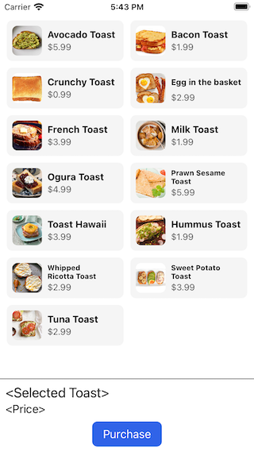

# SumUp Mobile Coding Challenge

See [pull request](https://github.com/timdolenko/interviewCaseStudy-sumUp/pull/1) for the result

The purpose of this assignment is to evaluate your coding performance and to understand your attitude towards software development.

## The task

In a fictive world, the demand for food delivery services has significantly increased in the past few months. A market gap was spotted that we need to fill with an app providing an essential service: toast delivery.

The goal is to create an app that lets you select and pay for a toast. Some development was already done and there are already a few types of toasts available for delivery, but the project is in a really rough state. We need you to jump in and save the mission!

Most of the logic is missing, so we will need you to connect the different existing components as well as implement new ones in order to:

1. Allow users to add a toast to their shopping cart
    * The selected toast should be displayed in the shopping cart component at the bottom of the screen, which currently contains a placeholder text
2. Create a checkout that includes the toast chosen by the user 
    * You can use the existing login component (`LoginController` class) to authorize and retrieve an access token
    * You can use the existing networking component (`SumUpCheckoutService` class, which calls the ["Create a checkout" API](https://developer.sumup.com/rest-api/#tag/Checkouts/paths/~1checkouts/post)) to create a checkout
3. Build a screen to enter credit card information
    * This should be a native screen
    * We do not expect you to implement any complex logic related to credit card information or payment data (e.g. it’s not necessary to do validation of the credit card information, to perform Luhn checks etc…)
4. Perform a checkout so that customers can pay for their toast
    * You need to call the ["Process a checkout" API](https://developer.sumup.com/rest-api/#tag/Checkouts/paths/~1checkouts~1{id}/put) endpoint for this
    * Indicate to the user if this payment was successful or not
5. We would also like to ask you to add one, meaningful test case (any type of test, e.g. unit or UI test). It is not needed to add more tests.

This app is not expected to be production-ready, the goal is to provide the functionalities listed above.
It should not be necessary to spend more than 4 to 6 hours to complete the challenge.

In the current state, the app looks like this:

## Test Account

In order for you to test your integration, please use the following test account from Germany:
* Email: `dev_mdeuf3am@sumup.com`
* Password: `extdev`

The test account has been granted the [`payments` scope](https://developer.sumup.com/docs/authorization/#restricted-scopes), so that you can use our API.
When processing a checkout, the process will look like a real transaction, but of course no money will be charged (the test account cannot process real payments).
